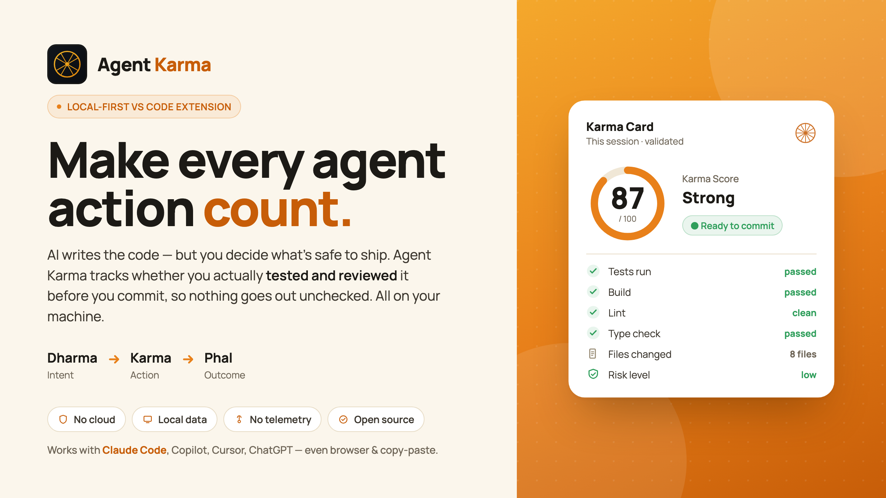

# Agent Karma

<p align="center">
  <picture>
    <source media="(prefers-color-scheme: dark)" srcset="docs/assets/agent-karma-hero-dark.png">
    
  </picture>
</p>

### You're the last line of trust. Agent Karma proves you're holding it.

**Agent Karma** is an open-source, local-first VS Code extension that helps you close your **verification gap** — turning *"did I actually check what the AI wrote before I trusted it?"* into a visible, objective habit. It works with Claude Code, GitHub Copilot, Cursor, ChatGPT, and others — including browser/copy-paste workflows.

It is **not** another AI coding assistant. It is **not** an enterprise analytics dashboard. It is **not** a surveillance tool.

> ## Mind the verification gap: did you validate what the AI produced — before you trusted it?

---

## ▶ Learn & experiment first — before you open VS Code

New to the idea? Start in the **[Agent Karma web app](https://ai-first-community.github.io/Agent-Karma/learn/)**: walk through the concept, then **practice in the Validation Dojo** — real scenarios scored by the same engine the extension uses. It's an installable **PWA** (add to your home screen, works offline). Build the verification habit in the app, then bring it into VS Code.

<p align="center">
  <a href="https://ai-first-community.github.io/Agent-Karma/learn/">
    
  </a>
  <br/>
  <em>📱 Scan to learn &amp; experiment on your phone — or visit <a href="https://ai-first-community.github.io/Agent-Karma/learn/">ai-first-community.github.io/Agent-Karma/learn</a></em>
</p>

---

## Why Agent Karma exists

The problem with AI code isn't *generating* it — it's *trusting* it. The industry now has a name and a number for this:

> **96% of developers don't fully trust AI-generated code — yet only 48% always verify it before committing.** *(Sonar, State of Code 2026)*

AWS's Werner Vogels calls the growing pile of unchecked AI code **"verification debt."** As agents write more of our code (already ~42% of committed code, heading toward 65%), **the developer becomes the last line of trust** — and most of us aren't reliably holding that line.

The industry's answer is to **automate** the review (Anthropic Code Review, CodeRabbit, Sonar…) — machines checking machine code. Agent Karma's answer is the opposite: keep the **human in the loop** by making verification a visible habit, *without* automating your judgment away — and without surveillance, gamification, or your code ever leaving your machine.

Every other tool measures AI *usage* for managers (acceptance rates, lines, tokens). Agent Karma measures one thing, **for you**: did you validate the AI's work? It is the mirror, not the dashboard.

---

## The philosophy: Dharma → Karma → Phal

Agent Karma is built on a simple idea: **every action has a consequence.**

| Concept | Meaning | In Agent Karma |
|---|---|---|
| **Dharma** | Intent, purpose, direction | What you asked the AI to do |
| **Karma** | Action | The changes you and the AI actually made |
| **Phal** | Outcome, fruit, consequence | Whether the result is validated and ready |

The thesis in one line: **unvalidated Karma bears uncertain Phal.** An action you never verified produces a fruit you can't trust. Agent Karma helps you notice the difference.

---

## What it does (MVP)

For each AI-assisted coding session, Agent Karma produces:

- 🪔 **Dharma Card** — your intent, prompt clarity, expected validation, and risk level
- 🔗 **Karma Trace** — a chronological, privacy-safe timeline of what happened (files saved, validation commands run, git diff summary)
- 🍃 **Phal Card** — the outcome: files changed, tests/build/lint detected, and whether it's ready for commit or review
- ⚖️ **Karma Score** — an **objective, transparent** score built only from the validation **actions** you actually took (tests/build/lint run, test coverage, change measured) — never a vague self-rating. Every point is explained.
- 🩺 **Validation Context Health** — *"can you even validate?"* — a config-only scan of your workspace for the means to verify AI output (test/build/lint/type check, a pre-commit net, CI, and whether your CLAUDE.md/AGENTS.md asks the AI to validate); it names your biggest gap and offers a one-click fix
- 🛡️ **Pre-commit nudge** *(opt-in)* — a local git hook that reminds you to validate AI-assisted changes *before* you commit them
- 📊 **Insight dashboard** — a calm, theme-adaptive view: a 🛞 karmic reflection, validation-consistency strip, Karma & validation **trend lines**, a task×check **heatmap**, risk×validation alignment, habit trends, a high-risk watchlist, and "what your Karma is made of"
- 🧾 **Local AI usage** *(opt-in, Claude Code)* — reads Claude Code's **local** session logs (no network, no API key, metadata only) to show what your AI work cost — tokens, turns, plus *wastage* (tokens spent on unvalidated work)
- 💬 **`@agentkarma` chat participant** — `/verify` (logs a validation — covers browser & copy-paste AI) and `/summary`
- 🏅 **Shareable Karma Card** — a personalised, self-explanatory certificate of your validation practice; export as SVG or print to PDF, generated entirely locally
- 📤 **Export** — your session as JSON or Markdown
- 🗑️ **Delete everything / Reset history** — wipe all local data, or just clear your Karma history while keeping settings

Everything is stored as plain JSON on your machine.

---

## What makes it unique

Agent Karma is the **only** tool that combines all of these:

- ✅ **Validation-first** — it measures whether you *verified* the AI's output (the actions you took: tests/build/lint/coverage), not how much code it generated. No competitor centers this.
- ✅ **Radically private** — no cloud, no login, no telemetry, no source upload, no terminal-output capture, no keystroke/scroll surveillance. This is the part incumbents structurally won't copy.
- ✅ **Coaching, not judgment** — objective, self-comparative, transparent, encouraging. No leaderboards.
- ✅ **Developer-owned** — readable local JSON, full export, one-click delete.

And it's **tool-agnostic by nature**: it works the same whether your AI ran in Copilot, Cursor, a Claude Code terminal, or a browser ChatGPT tab — because it watches your *validation actions*, which don't care where the code came from.

See [`docs/differentiation.md`](docs/differentiation.md) for the full comparison against GitHub Copilot Metrics, Microsoft's AI-Engineering-Coach, CodePause, Git AI, WakaTime, and more.

---

## Privacy promise

```
Local-first. No source code captured. No terminal output captured.
No cloud upload. No telemetry. No login. No surveillance.
```

What it *does* record is **metadata only**: file **names** (including edits made by AI agents or the CLI, gated by a setting), the validation command **types** you ran, git diff **counts**, and short commit **SHAs** — never file contents or terminal output. Your typed **intent text** is recorded locally **by default** so your cards read back meaningfully; turn it off any time with `agentKarma.capturePromptText` (either way it never leaves your machine).

Read the full contract in [`PRIVACY.md`](PRIVACY.md).

---

## Project status

🚧 **Pre-1.0, feature-complete and stable.** The full experience is built and tested — sessions, objective Karma Score, the insight dashboard, the opt-in pre-commit nudge, validation context health, the chat participant, opt-in local AI usage, and the shareable Karma Card. Every release ships with unit + integration tests, a zero-runtime-dependency build, and a CI-enforced no-network guard. Polishing toward a 1.0 Marketplace listing. See [`CHANGELOG.md`](CHANGELOG.md) and [`docs/roadmap.md`](docs/roadmap.md).

## Documentation

| Doc | What's in it |
|---|---|
| [`docs/vision.md`](docs/vision.md) | The broad vision + full Question Map (every question, by horizon and rigor) |
| [`docs/product-strategy.md`](docs/product-strategy.md) | Positioning, philosophy, locked decisions, non-goals |
| [`docs/differentiation.md`](docs/differentiation.md) | USPs and full competitive comparison |
| [`docs/competitive-coverage.md`](docs/competitive-coverage.md) | Per-feature verdict on every competitor capability (Adopt / Adapt / Reject) |
| [`docs/specification.md`](docs/specification.md) | Functional spec — sessions, cards, commands, capture, testing |
| [`docs/architecture.md`](docs/architecture.md) | Architecture, folder structure, data model |
| [`docs/scoring-model.md`](docs/scoring-model.md) | Karma Score, prompt hygiene hint, Dharma/Phal generation |
| [`docs/roadmap.md`](docs/roadmap.md) | Phase-wise release plan with acceptance criteria |
| [`docs/implementation-plan.md`](docs/implementation-plan.md) | Task-by-task build sequence (foundation-first) |
| [`CONTRIBUTING.md`](CONTRIBUTING.md) | Build rules & phase-wise protocol for contributors |

## License

Apache-2.0 — see [`LICENSE`](LICENSE). A purely individual, community contribution. Not affiliated with any employer or vendor.

Third-party components (including the Manrope font under the SIL Open Font License) are credited in [`THIRD-PARTY-NOTICES.md`](THIRD-PARTY-NOTICES.md).

**Disclaimer.** Agent Karma is provided **"AS IS"**, without warranty of any kind, express or implied. To the fullest extent permitted by law, the maintainer is not liable for any damages arising from its use (see Apache-2.0, Sections 7–8). It is a habit and awareness aid — **not** a guarantee of code correctness, security, or production-readiness. You remain responsible for validating and shipping your code.

---

*Use any AI coding tool. Agent Karma helps you use it better.*
